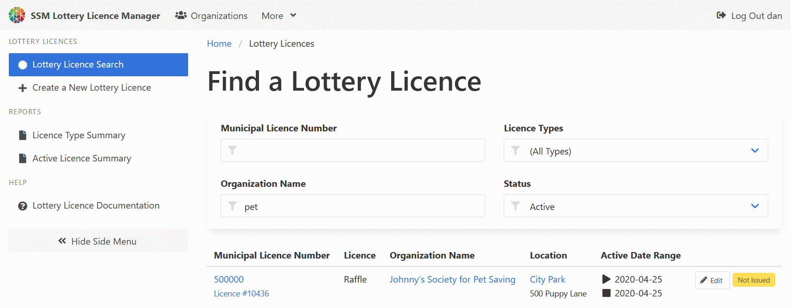

# Lottery Licence Manager

The Lottery Licence Manager is a web application written by the
[City of Sault Ste. Marie](https://saultstemarie.ca/)
to meet the lottery licensing requirements of Ontario municipalities
as defined by the
[Alcohol and Gaming Commission of Ontario](https://www.agco.ca/).

Although the system is quite niche, it's being released in an open source environment
in hopes to pool developer resources from other Ontario municipalities
looking to move away from older, legacy systems.

**This project is incomplete and under active development.**
**Significant, breaking changes are happening with each commit.**
**It is not ready to run in a live environment yet.**
**Completion is expected by mid-2021.**

It is being shared in it's current state to start the dialog
among other Ontario municipalities and present an option to those
who may be looking to refresh their own lottery licensing systems in the near future.

**[Installation Getting Started](/docs/admin-gettingStarted.md)**

**[User Documentation](/docs)**
