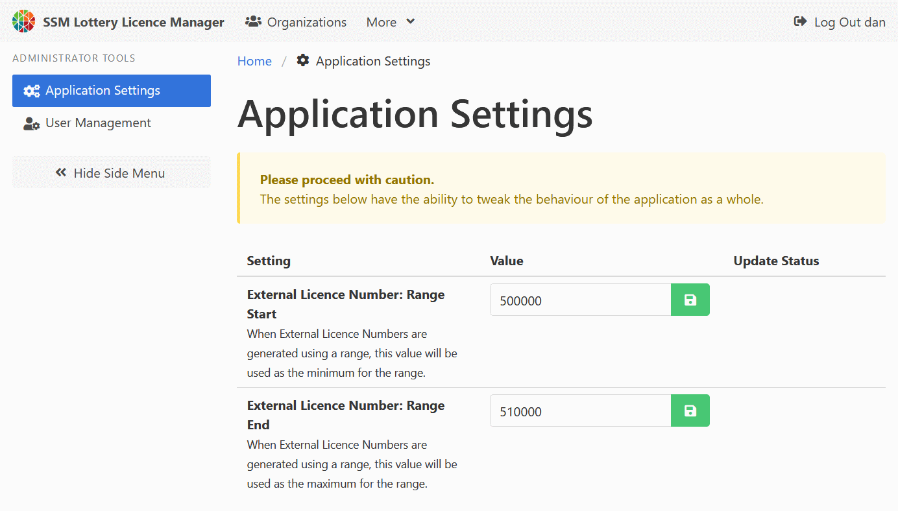

[Help Home](readme.md)

# Administrator Tools - Application Settings

The Application Settings page lets administrators update settings
that are regularly managed by a front end administrator.

At this time, there are two settings used to manage external licence numbers
that are automatically calculated using a number range.
