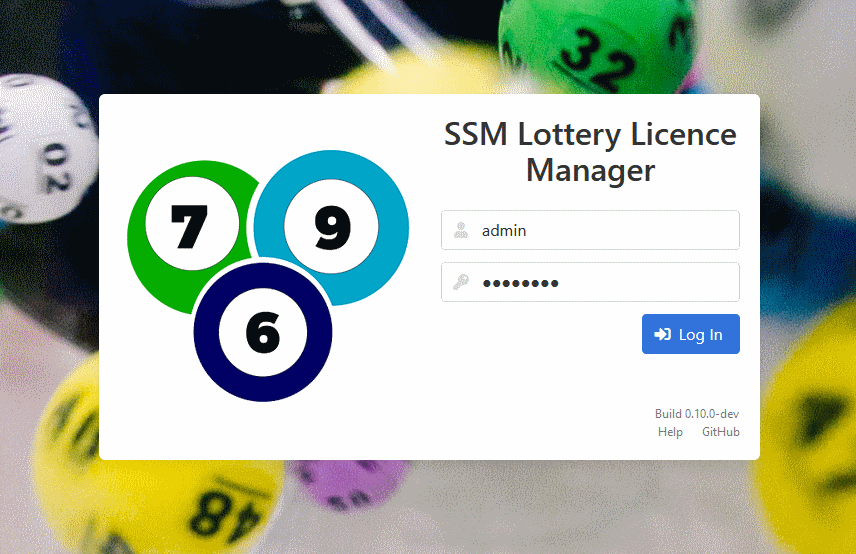

[Help Home](readme.md)

# Admin - Logging Into a New Install

Both the `data/users.db` and `data/licences.db` files are created automatically
when the server is started for the first time.  There are no users included
when these files are initialized.  You can get started by using the default admin user.

In your `data/config.js` file, set the following property:

```javascript
config.admin = {
  defaultPassword: "password"
};
```

As with all changes to the `config.js` file, you will have to restart Node
before the change takes effect.



Once set, you will be able to log into the application with `admin` as
the user name and the password set in your `config.js` file.

It is **not recommended** to use the `config.js` file on an ongoing basis
for your admin credentials.

You should visit the User Management area
to create a proper admin user with an encrypted password in the `users.db` database.

-   If you create a new user with `admin` as the user name,
    that new user will override the default admin user, even if the `admin.defaultPassword` property is set.

-   If you are not creating a user with the user name `admin`,
    it is recommended that your either remove the property from your `config.js` file altogether,
    or set it to blank when you're done.
