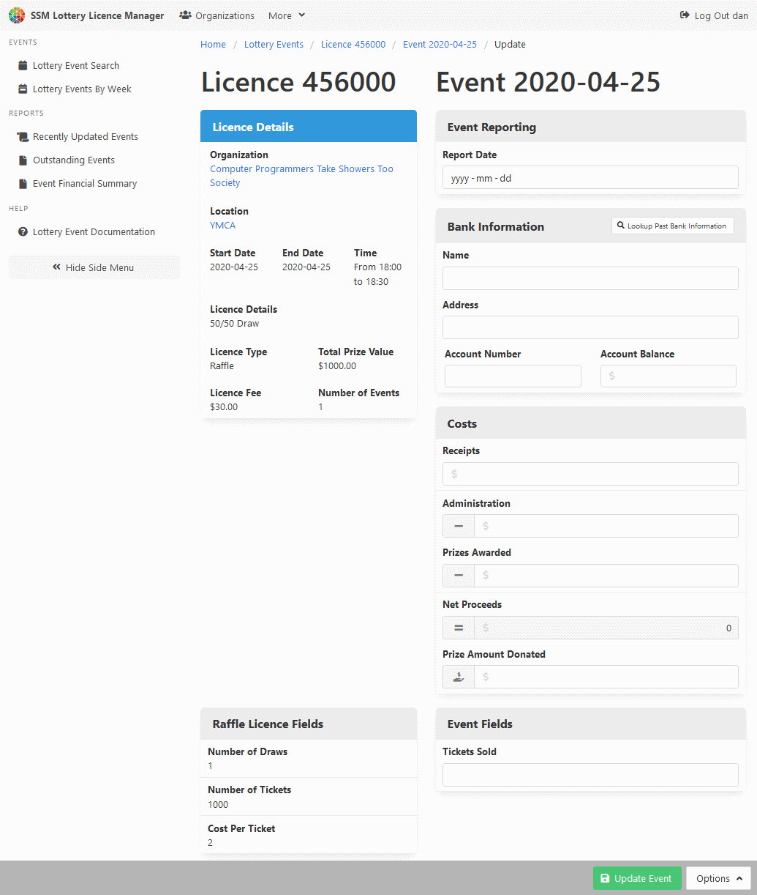

[Help Home](readme.md)

# Lottery Events

Lottery events are used to report the outcome of lottery licences.
The number of events included as part of a lottery licence
depends on your individual reporting requirements.

Some suggestions, based on Sault Ste. Marie's requirements:

- In the case of a lottery licence for a raffle with a period of ticket sales,
  one event record should be created for each draw date.

- In the case of a lottery licence for eight bingo events,
  eight event records should be created, one for each event date.

- In the case of a lottery licence for one year of break-open (Nevada) ticket sales,
  one event record should be made for the last date of sales.
  If the ticket sales are extended for an additional year,
  a second event should be added to the licence for the new licence end date.

Lottery events are created on the lottery licence itself.

## View and Update a Lottery Event

## Related Documentation

- [Organizations](organizations.md)
- [Lottery Licences](licences.md)
