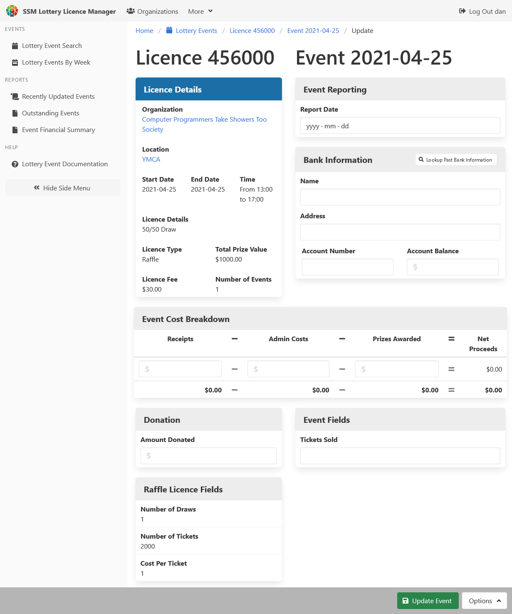

[Help Home](readme.md)

# Lottery Events

Lottery events are used to report the outcome of lottery licences.
The number of events included as part of a lottery licence
depends on your individual reporting requirements.

Some suggestions, based on Sault Ste. Marie's requirements:

-   In the case of a lottery licence for a raffle with a period of ticket sales,
    one event record should be created for each draw date.

-   In the case of a lottery licence for eight bingo events,
    eight event records should be created, one for each event date.

-   In the case of a lottery licence for one year of break-open (Nevada) ticket sales,
    one event record should be made for the last date of sales.
    If the ticket sales are extended for an additional year,
    a second event should be added to the licence for the new licence end date.

Lottery events are created on the lottery licence itself.

## View and Update a Lottery Event

_Note that events are created from the licence edit view._

Event records include banking information, a cost breakdown,
and custom fields that vary by the type of licence.

Event records are considered _reported_ when the Report Date field is populated.

## Admins Only!!!  Updating a Locked Event

This option is currently only available to users with admin access.

To preserve the integrity of older records, event records become locked
after they have been reported and after they have not been changed for a period of time.

To unlock locked event records, administrators should visit the event record they wish to update,
then add `/poke` to the end of the URL.

For example, if the event URL looks like this:

    http://llm.local:3000/events/123/20200425

Append `/poke` to the end, like this:

    http://llm.local:3000/events/123/20200425/poke

After the page refreshes, the event record should have the option to edit.

## Related Documentation

-   [Organizations](organizations.md)
-   [Lottery Licences](licences.md)
-   [Locations](locations.md)
