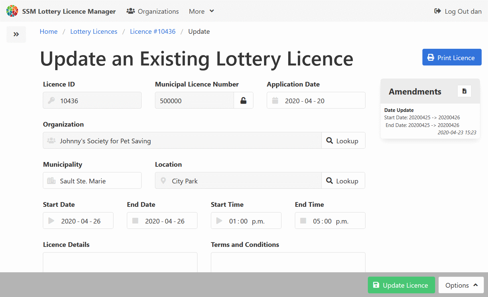

[Help Home](readme.md)

# Lottery Licences

## Documentation Note

Many options in this application can be configured for your individual requirements.
For the purposes of documentation, lottery licences are described using the rules defined
by the Alcohol and Gaming Corporation of Ontario (AGCO),
and enforced within the City of Sault Ste. Marie.

## Finding a Lottery Licence with the Lottery Licence Search

There are many ways to find a lottery licence record.
The Lottery Licence Search page offers another way, from a list of licence records.
You can find it in the navigation bar at the top of every page, or on the home dashboard.

There are several filters to help with finding lottery licences.

-   Municipal Licence Number (a customized name for the External Licence Number field)
-   Licence Type
-   Organization Name
-   Licence Status (set to display active lottery licences only by default)

Search results are refreshed when you change the value of a search filter.
If the refresh is not triggered automatically, press <kbd>Enter</kbd> to trigger the refresh.

Search results are displayed below the filters in a table and include the following columns.

-   Licence Identifiers, linked to the lottery licence record.
-   Licence Type and Licence Details.
-   Organization Name, linked to the organization record.
-   Location, linked to the Location record.
-   Licence Date Range.
-   Licence Edit Link, depending on user permissions.
-   "Not Issued" Indicator or a Print Licence button.

## Create a New Lottery Licence

New lottery licences can be created from the lottery licence side menu,
from the main dashboard, or from an organization view.

A corresponding organization record should exist prior to creating
a lottery licence.

Using the [config.js](admin-configJS.md) file, the Municipal Licence Number field can be automatically populated
by using a range of numbers.

The available licence types can be defined in the config.js file.
Depending on the licence type selected, additional options may appear,
like ticket types and data fields.
**The licence type cannot be changed after the licence has been created.**

Lottery licences must have one or more event dates.
Event dates must be distinct.
There are options to add single events, with the large "Add an Event Date" button
defaulting to the licence end date.
The "Event Calculator" assists with adding multiple regularly occurring events,
like a weekly bingo event for example.

To save the new lottery licence, click the green "Create New Licence and Continue" button.

## View and Update a Lottery Licence

_Note that, although the update screens are described below,
the read only screens behave similarly._

Once a lottery licence record has been created, transactions can be added.
While the Lottery Licence Manager application is not meant to be
a cash receipting system or a general ledger,
it does offer a way to calculate a licence fee and mark a licence fee as paid.
Fee calculations can be customized in the [config.js](admin-configJS.md) file.

Before a lottery licence can be printed, it must be issued.
To issue a licence, click the green "Issue Licence" button,
found at the top of the page.

Once a licence has been issued, further changes to the licence can be
automatically tracked as amendments.

## Admins Only!!!  Updating a Locked Licence

This option is currently only available to users with admin access.

To preserve the integrity of older records, licence records become locked
after they have have ended and after they have not been changed for a period of time.

To unlock locked licence records, administrators should visit the licence record they wish to update,
then add `/poke` to the end of the URL.

For example, if the licence URL looks like this:

    http://llm.local:3000/licences/123

Append `/poke` to the end, like this:

    http://llm.local:3000/licences/123/poke

After the page refreshes, the licence record should have the option to edit.

## Related Documentation

-   [Organizations](organizations.md)
-   [Lottery Events](events.md)
-   [Locations](locations.md)
