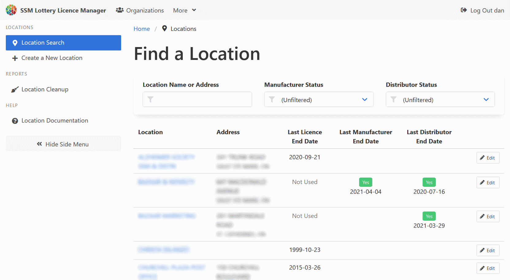
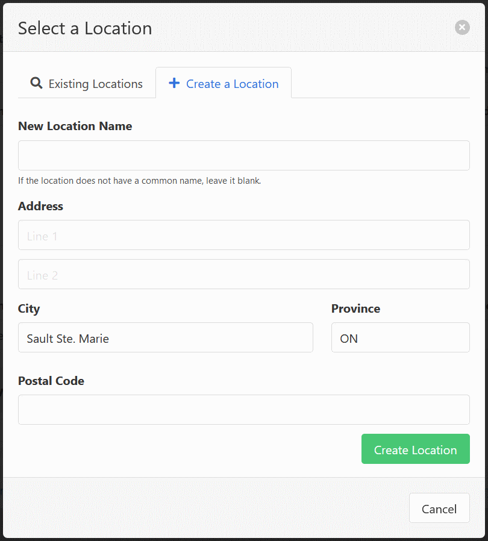
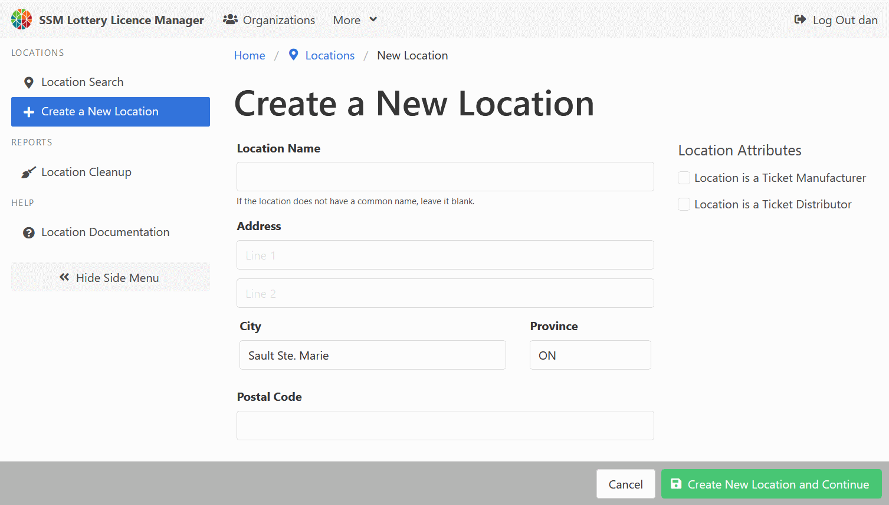
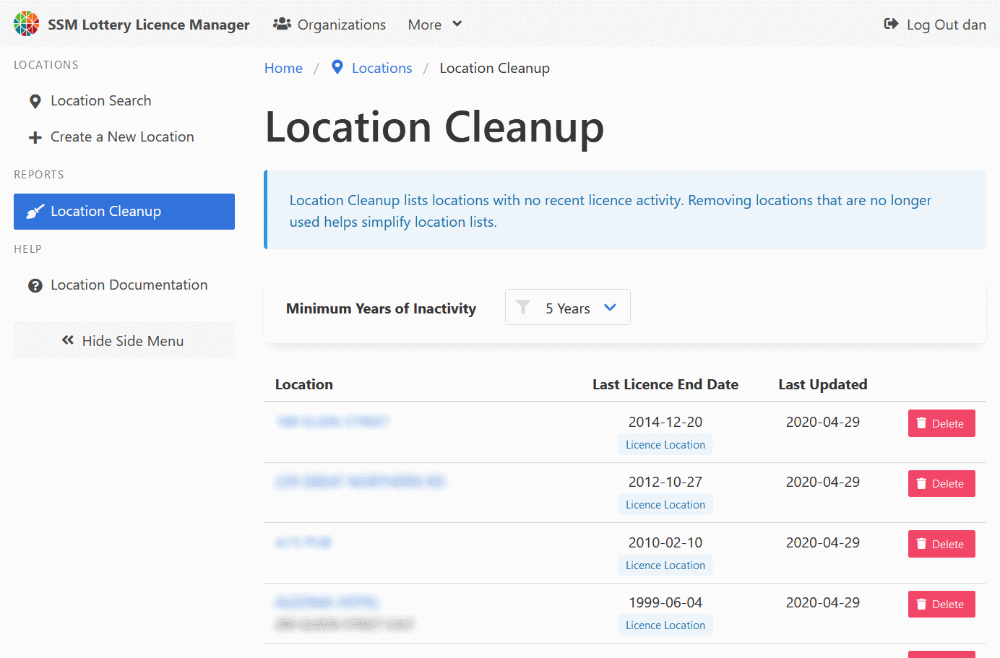

[Help Home](readme.md)

# Locations

Locations have two main purposes.

-   They are used to track the place a lottery event is taking place.

-   They are used to track the manufacturer and distributor details of lottery tickets
    on licences with defined ticket types.

## Find a Location Record with the Location Search

The Location Search page offers a way to find location records.
You can find in in the navigation bar at the top of every page,
or on the home dashboard.

The Location Search page offers several filters to help find location records.

-   Location Name or Address
-   Manufacturer Status (whether the location is marked as a manufacturer or not)
-   Distributor Status (whether the location is marked as a distributor or not)

Search results are refreshed when you change the value of a search filter.
If the refresh is not triggered automatically, press <kbd>Enter</kbd> to trigger the refresh.

Each search result displays the last time the location was seen used on a lottery licence.
Locations with no activity can be deleted by update users right from the search results.

## Create a New Location Record

Location records can be created in two ways.

When creating or updating a lottery licence, it is possible to create a location record
by selecting the "Create a Location" tab at the top of the "Select a Location" popup window.

It is also possible to create a location record by selecting the "Create a New Location" link.

The location name field is only required for locations marked as ticket manufacturers or ticket distributors.
Location name is an optional field for all other locations,
and should only be used for a common name or business name,
not the first line of the address itself.  If the location does not have a common name or a business name,
the location name field should be left blank.

## Cleanup Unused Locations

The Location Cleanup page helps draw attention to location records
that may be able to be removed from the system.
It lists locations with no recent licence activity.
Location records can be reviewed by clicking on their names,
or quickly removed with the corresponding red "Delete" button.

## Related Documentation

-   [Lottery Licences](licences.md)
-   [Lottery Events](events.md)
