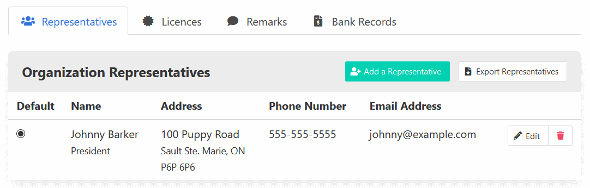

[Help Home](readme.md)

# Organizations

Organizations are the groups that hold lottery licences.

## Find an Organization with the Organization Search

The starting point for finding an organization record is the Organization Search page.
You can find it in the navigation bar at the top of every page,
or on the home dashboard.

The Organization Search page offers several filters to help find organization records.

- Organization Name
- Representative Name
- Licence Eligibility (set to display eligible organizations only by default)

Note that both the Organization Name and Representative Name fields
are case insensitive and can take several search terms at the same time.

For example, the organization record for *Johnny's Society for Pet Saving*
can be found by searching for:

- `pet saving john`
- `pet society`

*Johnny's Society for Pet Saving* would not be found however by searching for
`johnnys pets` since neither term exists fully in the organization name.
For that reach, it is recommended to use more generic searches when possible,
and increase specificity if needed.

Search results are refreshed when you change the value of a search filter.
If the refresh is not triggered automatically, press <kbd>Enter</kbd>
to trigger the refresh.

Search results are displayed below the filters in a table,
and include the following columns.

- Organization Name, linked to the organization record.
- Organization Note Indicator, if applicable.
- Default Representative.
- Organization Edit Link, depending on user permissions.
- Active Licences or Last Active Licence Date.
- New Licence Link.

## Create a New Organization Record

When creating a new organization record, the only required piece of information
is the organization name.  To create the record,
click the green "Create New Organization and Continue" button.

## View and Update an Organization Record

*Note that, although the update screens are described below,
the read only screens behave similarly.*

All aspects of an organization can be updated.
Changes to the main record (i.e. the form above the tabs)
can be saved using the "Update Organization" button.

**Never change an organization into another organization through updates.**
Organization records are associated with licences, and by changing one
organization into another, those licences will become associated with the new organization.
In this case, it is best to create a new organization, and delete the
one that is no longer needed.

To delete an organization, expand the "Options" button, and select "Delete Organization".
Deleted organizations can be recovered using the Organization Recovery page.

### Tab - Organization Representatives

Representatives serve as contacts for the organization.
An organization can have as many representatives as necessary,
but only one of them can be marked as default.

Add new representatives using the teal "Add a Representative" button.

Make changes to existing representatives using the corresponding "Edit" buttons.

Remove representatives using the corresponding "Delete" buttons.

Export a CSV document (compatible with Microsoft Excel) of all active representatives
using the "Export Representatives" button.

### Tab - Lottery Licences

A table of active and historical lottery licences associated with the organization is available.
Licences that have been issued can be printed using the corresponding "Print" link.

A complete licence history for the organization can be exported as a CSV document
using the "Export Licences" button.

### Tab - Remarks

The remarks section acts as a running comment log for the organization.
Remarks can be marked as important to further highlight them in the list.

A complete remark history for the organization can be exported as a CSV document
using the "Export Remarks" button.

### Tab - Bank Records

The bank records section helps track each organization's financial reporting requirements.
The types of documents can be customized.
Click any record cell to create, edit, or delete the record.
Records can also be created using the teal "Add a Bank Record" button.

A complete history of bank records for the organization can be exported as a CSV document
using the "Export Bank Records" button.

## Cleanup Inactive Organizations

The Organization Cleanup page helps draw attention to organizations that may be able to be
removed from the system. It lists organizations with no recent licence activity.
Organizations can be reviewed by clicking on their names, or quickly removed with
the corresponding red "Delete" button.

## Recover Deleted Organizations

The Organization Recovery page lists organizations that have been deleted,
along with the date they were deleted.  Organizations can be reviewed and restored.

## Related Documentation

- [Lottery Licences](licences.md)
- [Lottery Events](events.md)
