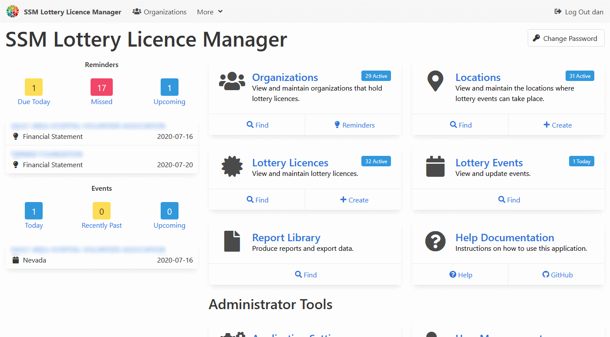

# Lottery Licence Manager Documentation

**Thank you for taking the time to read the documentation.**

**[Tips and Tricks](tipsTricks.md)**

**[Organizations](organizations.md)** 
What are organizations?
How do I search organization records?
How do I maintain organization records?

**[Lottery Licences](licences.md)** 
How do I search lottery licence records?
How do I maintain lottery licences?

**[Lottery Events](events.md)** 
What are lottery events?
How do I find lottery event records?
How do I report on lottery events?

**[Locations](locations.md)** 
What are location records?
What are they used for?
How do I find location records?
How do I maintain location records?

## Administrator Documentation

**[Getting Started](admin-gettingStarted.md)** 
How to setup and start the application for the first time.

**[config.js file](admin-configJS.md)** 
How to use the configuration file to customize the application.

**[Logging into a New Install](admin-login.md)** 
How to activate the default admin user to access the application for the first time.

**[Administrator Tools - Application Settings](admin-applicationSettings.md)** 
Tweak some additional settings.

**[Administrator Tools - User Management](admin-userManagement.md)** 
How to add, update, and remove user accounts.
